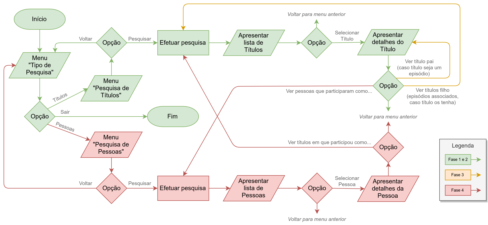

<!--
1º Projeto de Linguagens de Programação II 2019/2020 (c) by Nuno Fachada

1º Projeto de Linguagens de Programação II 2019/2020 is licensed under a
Creative Commons Attribution-NonCommercial-ShareAlike 4.0 International License.

You should have received a copy of the license along with this
work. If not, see <http://creativecommons.org/licenses/by-nc-sa/4.0/>.
-->

# 1º Projeto de Linguagens de Programação II 2019/2020

_**Atenção:** enunciado em construção!_

## Introdução

Os grupos devem implementar uma aplicação em C# que realize pesquisas na base
de dados do [IMDB], disponível sob a forma de um
[conjunto de ficheiros][IMDBDataGz], cuja documentação se encontra
[aqui][IMDBData].

A aplicação pode ser desenvolvida numa das seguintes plataformas, sem qualquer
benefício ou limitação em termos de nota:

1. Console App .NET Core
2. Unity 2019.2.\*

No entanto, é requisito obrigatório deste projeto que a aplicação utilize
[LINQ] (sintaxe fluente ou expressões de *query*) para realizar as pesquisas.
É necessário ir mais além do que foi lecionado nas aulas sobre [LINQ], e a
discussão do projeto incidirá essencialmente na forma como construíram as
*queries*.

## Funcionamento da aplicação

A aplicação deve permitir fazer pesquisas a **títulos**, e possivelmente
**pessoas**, caso implementem a [Fase 4] do projeto. Considera-se um **título**
qualquer filme, série, episódio de uma série, vídeo, programa de televisão, e
por ai fora. Uma **pessoa** é alguém que está de alguma forma relacionada com
um título (por exemplo, um ator).

O seguinte fluxograma apresenta uma ideia geral do funcionamento da aplicação,
com os requisitos mínimos para as diferentes fases:



A aplicação final não tem de seguir exatamente estes passos, desde que siga a
ideia geral. Por exemplo, podem optar por permitir terminar a aplicação em
qualquer altura, e/ou, caso não cheguem à [Fase 4], podem simplesmente ignorar o
menu "Tipo de Pesquisa", uma vez que só vão pesquisar por títulos.

A aplicação deve mostrar ao utilizador um menu de pesquisa de títulos, e caso
implementem a [Fase 4], um menu de pesquisa de pessoas. Em qualquer dos casos,
deve ser possível ao utilizador usar como critérios de pesquisa um ou mais dos
campos indicados em cada uma das [fases de desenvolvimento]. Deve também ser
possível usar qualquer um destes campos como critério de ordenação.

Se o projeto for desenvolvido em consola, podem ser apresentados 20 ou 30 itens
de cada vez, sendo necessário que o utilizador pressione uma tecla para ver os
próximos 20/30 itens. Por outro lado, se se tratar de um projeto Unity, a lista
de jogos deve ser *scrollable* ("rolável") para cima e para baixo. Também é
possível ter uma lista "rolável" em modo consola, como implementado na solução
do [2º projeto de LP1 2018/19].

## Fases de desenvolvimento

### Fase 1: pesquisa de títulos básica

Nesta fase deve ser possível realizar pesquisas de títulos, bem como ordenar os
resultados das pesquisas, usando os seguintes campos:

* **Tipo**: filme, curta, série, episódio, etc.
* **Título primário**: o título do título.
* **Para adultos?**: sim ou não.
* **Ano de início**: ano de lançamento do título, ou no caso de uma série, o
  ano em que a mesma começou.
* **Ano de fim**: no caso de uma série, o ano em que a mesma terminou.
* **Géneros**: até três géneros associados ao título (e.g. comédia, ação, etc).

No caso do **tipo** e dos **géneros**, serão valorizadas soluções que permitam
ao utilizador escolher apenas entre os tipos e/ou géneros existentes na base de
dados.

A implementação desta fase é o requisito mínimo para o projeto ser avaliado,
permitindo uma nota até 1.8 valores (em 3 possíveis).

### Fase 2: pesquisa de títulos com classificação

Além dos requisitos da [Fase 1], deve também ser possível realizar pesquisas de
títulos, bem como ordenar os resultados das pesquisas, usando a
**Classificação**, entre 0 a 10, atribuída ao título.

A implementação desta fase permite uma nota até 2.2 valores (em 3 possíveis).

### Fase 3: ligação entre séries e os respetivos episódios

_Em construção_

A implementação desta fase permite uma nota até 2.6 valores (em 3 possíveis).

### Fase 4: pesquisa de pessoas

_Em construção_

A implementação desta fase permite a nota máxima de 3 valores.

## Ficheiros com dados

### Onde colocar os ficheiros

Os dados estão distribuídos por [vários ficheiros][IMDBDataGz] comprimidos no
formato `GZip`. Estes ficheiros devem ser colocados na pasta `MyIMDBSearcher`,
que por sua vez deve existir no diretório de aplicações locais do computador,
tipicamente `C:\Users\OTeuUsername\AppData\Local` em Windows ou
`/home/OTeuUsername/.local/share` em Linux. Por exemplo, em Windows, o caminho
completo do ficheiro `title.ratings.tsv.gz` deverá ser
`C:\Users\OTeuUsername\AppData\Local\MyIMDBSearcher\tile.ratings.tsv.gz`,
podendo haver diferenças ao nível da *drive* (que poderá não ser `C:`), e
certamente ao nível do nome de utilizador.

Os ficheiros não podem ser alterados, nem pela vossa aplicação, nem
manualmente. Em nenhum momento os ficheiros devem ser colocados na pasta do
projeto, muito menos adicionados ao repositório Git.

### Formato dos ficheiros

Os ficheiros estão comprimidos no formato `GZip`, e é neste formato que devem
ser utilizados pela aplicação a desenvolver. Quando descomprimidos, tratam-se
de simples ficheiros de texto no formato [TSV]. No formato [TSV] cada linha
corresponde a uma entrada de dados, exceto a primeira linha, que contém o
cabeçalho dos dados (por outras palavras, o nome de cada coluna).

A descrição sobre o conteúdo de cada um destes ficheiros, bem como a forma como
eles se relacionam, está descrita na [respetiva página do IMDB][IMDBData].
Para desenvolver o projeto com sucesso é essencial que esta documentação, bem
como os ficheiros em si, sejam estudados com bastante cuidado. Uma forma rápida
de ver os conteúdos dos ficheiros comprimidos consiste em usar o seguinte
comando:

`gzip -c -d title.episode.tsv.gz | less`

Este comando funciona na consola Git Bash em Windows e no terminal em Linux
(não funciona no CMD ou PowerShell). Devem substituir o nome do ficheiro pelo
ficheiro que pretendem analisar, bem como estar na mesma pasta onde estão os
ficheiros, fazendo os `cd` necessários para tal. Se descomprimirem os ficheiros
e os tentarem abrir num editor, é provável que o editor _crashe_ devido ao seu
tamanho. Escolham um editor capaz de o fazer, como por exemplo o Visual Studio
Code com a extensão [Rainbow CSV] (que também suporta o formato [TSV]).

### Como abrir os ficheiros na aplicação a desenvolver

Uma vez que a aplicação deve funcionar em diferentes sistemas operativos,
devem usar os métodos e propriedades utilitários fornecidos pelas classes
[`Environment`] e [`Path`] para obter o caminho completo destes ficheiros. Por
exemplo:

```cs
/// Ao nível de uma classe
private const string appName = "MyIMDBSearcher";
private const string fileTitleBasics = "title.basics.tsv.gz";
private const string fileTitleRatings = "title.ratings.tsv.gz";
// etc...
```

```cs
/// Ao nível de um método

// Caminho completo da pasta contendo os ficheiros de dados
string folderWithFiles = Path.Combine(
    Environment.GetFolderPath(Environment.SpecialFolder.LocalApplicationData),
    appName);

// Caminho completo de cada um dos ficheiros de dados
string fileTitleBasicsFull = Path.Combine(folderWithFiles, fileTitleBasics);
string fileTitleRatingsFull = Path.Combine(folderWithFiles, fileTitleRatings);
// etc...
```

A aplicação deve abrir diretamente os ficheiros comprimidos, usando o
[decorador de *streams* apropriado da API do C#](GZipStream), de modo a que
o adaptador [StreamReader] possa ler texto descomprimido (em formato [TSV]).

Se algum ficheiro necessário não existir ou tiver um formato inválido, a
aplicação deve terminar com uma mensagem de erro apropriada.

### Sugestões de otimização

Os ficheiros de dados são bastante grandes, no entanto a aplicação a ser
desenvolvida não pode utilizar mais do que 6 gigabytes de memória, sendo
bonificados projetos que necessitem de menos memória. Existem várias técnicas
que podem e devem ser utilizadas para manter utilização de memória sob
controlo, nomeadamente:

* Dependendo da fase que atingirem, poderão precisar de apenas um ou dois
  ficheiros. Não abram/leiam ficheiros cuja informação não vão usar.
* Muitos dos campos existentes em cada linha também não são necessários,
  devendo ser ignorados de modo a poupar memória.
* Usem tipos apropriados e o mais "pequenos" possível para cada um dos campos.
  Por exemplo, para representar o ano de lançamento é mesmo preciso um `int`?
* Considerem pré-alocar as coleções que vão usar com o tamanho exato necessário
  para guardarem os respetivos dados. Por exemplo, as listas têm um
  [construtor][ListSizeCtor] que aceita como parâmetro o tamanho inicial da
  lista, e os _arrays_ são sempre pré-alocados.
* Se forem bem utilizadas, as *structs* podem poupar memória relativamente às
  classes.
* Tanto o Unity, como o C# de forma nativa, oferecem formas de analisar a
  quantidade de memória ocupada. Usem essa funcionalidade durante o
  desenvolvimento do projeto para terem noção da memória que estão a utilizar.
  Por exemplo, usando as funcionalidades nativas do C#:
  ```cs
  using System.Diagnostics;

  //...

  Console.WriteLine("My app is occupying "
    + (Process.GetCurrentProcess().VirtualMemorySize64 / 1024 / 1024)
    + " megabytes of memory");
  ```

## Organização do projeto e estrutura de classes

O projeto deve estar devidamente organizado, fazendo uso de classes, `struct`s
e/ou enumerações, conforme seja mais apropriado. Cada tipo (i.e., classe,
`struct` ou enumeração) deve ser colocado num ficheiro com o mesmo nome. Por
exemplo, uma classe chamada `Title` deve ser colocada no ficheiro `Title.cs`.
Por sua vez, a escolha da coleção ou coleções a usar também deve ser adequada
ao problema.

A estrutura de classes deve ser bem pensada e organizada de forma lógica,
fazendo uso de *design patterns* quando e se apropriado. Em particular, o
projeto deve ser desenvolvido tendo em conta os princípios de programação
orientada a objetos, como é o caso, entre outros, dos princípios [SOLID].

Estes princípios devem ser balanceados com o princípio [KISS], crucial no
desenvolvimento de qualquer aplicação.

É de realçar que o uso de LINQ, Lambdas e *nullables* é essencial neste
projeto.

## Objetivos e critério de avaliação

Este projeto tem os seguintes objetivos:

* **O1** - Programa deve funcionar como especificado.
* **O2** - Projeto e código bem organizados, nomeadamente:
  * Estrutura de classes bem pensada (ver secção
    [Organização do projeto e estrutura de classes][orgclasses].
  * Código devidamente comentado e indentado.
  * Inexistência de código "morto", que não faz nada, como por exemplo
    variáveis, propriedades ou métodos nunca usados.
  * Projeto compila e executa sem erros e/ou *warnings*.
* **O3** - Projeto adequadamente documentado. Documentação deve ser feita com
  [comentários de documentação XML][XML], e a documentação (gerada em formato
  HTML ou CHM com [Doxygen], [Sandcastle] ou ferramenta similar) deve estar
  incluída no ZIP do projeto, mas **não** integrada no repositório Git.
* **O4** - Repositório Git deve refletir boa utilização do mesmo, com
  *commits* de todos os elementos do grupo e mensagens de *commit* que sigam
  as melhores práticas para o efeito (como indicado
  [aqui](https://chris.beams.io/posts/git-commit/),
  [aqui](https://gist.github.com/robertpainsi/b632364184e70900af4ab688decf6f53),
  [aqui](https://github.com/erlang/otp/wiki/writing-good-commit-messages) e
  [aqui](https://stackoverflow.com/questions/2290016/git-commit-messages-50-72-formatting)).
  Quaisquer *assets* binários, tais como imagens, devem ser integrados
  no repositório em modo Git LFS.
* **O5** - Relatório em formato [Markdown] (ficheiro `README.md`),
  organizado da seguinte forma:
  * Título do projeto.
  * Autoria:
    * Nome dos autores (primeiro e último) e respetivos números de aluno.
    * Informação de quem fez o quê no projeto. Esta informação é
      **obrigatória** e deve refletir os *commits* feitos no Git.
    * Indicação do repositório público Git utilizado. Esta indicação é
      opcional, pois podem preferir desenvolver o projeto num repositório
      privado.
  * Arquitetura da solução:
    * Descrição da solução, com breve explicação de como o programa foi
      organizado, indicação das coleções usadas e porquê, bem como dos
      algoritmos utilizados (e.g., para fazer *parsing* dos ficheiros TSV),
      as principais *queries* que construíram, bem como as otimizações
      específicas que implementaram.
    * Um diagrama UML de classes simples (i.e., sem indicação dos
      membros da classe) descrevendo a estrutura de classes.
  * Referências, incluindo trocas de ideias com colegas, código aberto
    reutilizado (e.g., do StackOverflow) e bibliotecas de terceiros
    utilizadas. Devem ser o mais detalhados possível.
  * **Nota:** o relatório deve ser simples e breve, com informação mínima e
    suficiente para que seja possível ter uma boa ideia do que foi feito.
    Atenção aos erros ortográficos e à correta formatação [Markdown], pois
    ambos serão tidos em conta na nota final.

O projeto tem um peso de 3 valores na nota final da disciplina e será avaliado
de forma qualitativa. Isto significa que todos os objetivos têm de ser
parcialmente ou totalmente cumpridos. A cada objetivo, O1 a O5, será atribuída
uma nota entre 0 e 1. A nota do projeto será dada pela seguinte fórmula:

*N = 3 x O1 x O2 x O3 x O4 x O5 x D*

Em que *D* corresponde à nota da discussão e percentagem equitativa de
realização do projeto, também entre 0 e 1. Isto significa que se os alunos
ignorarem completamente um dos objetivos, não tenham feito nada no projeto ou
não comparerecem na discussão, a nota final será zero.

**Atenção:** projetos que usem mais de 6 gigabytes de memória não serão
avaliados.

## Entrega

O projeto deve ser entregue por **grupos de 2 a 3 alunos** via Moodle até às
23h de 8 de dezembro de 2019. Deve ser submetido um ficheiro `zip` com a
solução completa do projeto, nomeadamente:

* Pasta escondida `.git` com o repositório Git local do projeto.
* Documentação HTML ou CHM gerada com [Doxygen], [Sandcastle] ou ferramenta
  similar.
* Ficheiro `README.md` contendo o relatório do projeto em formato [Markdown].
* Ficheiros de imagens, contendo o diagrama UML de classes e outras figuras
  que considerem úteis. Estes ficheiros devem ser incluídos no repositório em
  modo Git LFS.

## Honestidade académica

Nesta disciplina, espera-se que cada aluno siga os mais altos padrões de
honestidade académica. Isto significa que cada ideia que não seja do
aluno deve ser claramente indicada, com devida referência ao respectivo
autor. O não cumprimento desta regra constitui plágio.

O plágio inclui a utilização de ideias, código ou conjuntos de soluções
de outros alunos ou indivíduos, ou quaisquer outras fontes para além
dos textos de apoio à disciplina, sem dar o respectivo crédito a essas
fontes. Os alunos são encorajados a discutir os problemas com outros
alunos e devem mencionar essa discussão quando submetem os projetos.
Essa menção **não** influenciará a nota. Os alunos não deverão, no
entanto, copiar códigos, documentação e relatórios de outros alunos, ou dar os
seus próprios códigos, documentação e relatórios a outros em qualquer
circunstância. De facto, não devem sequer deixar códigos, documentação e
relatórios em computadores de uso partilhado.

Nesta disciplina, a desonestidade académica é considerada fraude, com
todas as consequências legais que daí advêm. Qualquer fraude terá como
consequência imediata a anulação dos projetos de todos os alunos envolvidos
(incluindo os que possibilitaram a ocorrência). Qualquer suspeita de
desonestidade académica será relatada aos órgãos superiores da escola
para possível instauração de um processo disciplinar. Este poderá
resultar em reprovação à disciplina, reprovação de ano ou mesmo suspensão
temporária ou definitiva da ULHT.

*Texto adaptado da disciplina de [Algoritmos e
Estruturas de Dados][aed] do [Instituto Superior Técnico][ist]*

## Referências

* \[1\] Whitaker, R. B. (2016). **The C# Player's Guide** (3rd Edition).
  Starbound Software.
* \[2\] Albahari, J. (2017). **C# 7.0 in a Nutshell**. O’Reilly Media.
* \[3\] IMDB (2019). **IMDb Datasets**. Retrieved from
  <https://www.imdb.com/interfaces/>.
* \[4\] Freeman, E., Robson, E., Bates, B., & Sierra, K. (2004). **Head First
  Design Patterns**. O'Reilly Media.
* \[5\] Dorsey, T. (2017). **Doing Visual Studio and .NET Code Documentation
  Right**. Visual Studio Magazine. Retrieved from
  <https://visualstudiomagazine.com/articles/2017/02/21/vs-dotnet-code-documentation-tools-roundup.aspx>.

## Licenças

Este enunciado é disponibilizado através da licença [CC BY-NC-SA 4.0].

## Metadados

* Autor: [Nuno Fachada]
* Curso:  [Licenciatura em Videojogos][lamv]
* Instituição: [Universidade Lusófona de Humanidades e Tecnologias][ULHT]

[LINQ]:https://docs.microsoft.com/en-us/dotnet/csharp/programming-guide/concepts/linq/introduction-to-linq-queries
[CC BY-NC-SA 4.0]:https://creativecommons.org/licenses/by-nc-sa/4.0/
[lamv]:https://www.ulusofona.pt/licenciatura/videojogos
[Nuno Fachada]:https://github.com/fakenmc
[ULHT]:https://www.ulusofona.pt/
[aed]:https://fenix.tecnico.ulisboa.pt/disciplinas/AED-2/2009-2010/2-semestre/honestidade-academica
[ist]:https://tecnico.ulisboa.pt/pt/
[Markdown]:https://guides.github.com/features/mastering-markdown/
[Doxygen]:https://www.stack.nl/~dimitri/doxygen/
[Sandcastle]:https://github.com/EWSoftware/SHFB
[SOLID]:https://en.wikipedia.org/wiki/SOLID
[KISS]:https://en.wikipedia.org/wiki/KISS_principle
[TSV]:https://en.wikipedia.org/wiki/Tab-separated_values
[XML]:https://docs.microsoft.com/dotnet/csharp/codedoc
[`Process`]:https://docs.microsoft.com/dotnet/api/system.diagnostics.process
[IMDB]:https://www.imdb.com/
[IMDBData]:https://www.imdb.com/interfaces/
[IMDBDataGz]:https://datasets.imdbws.com/
[`Environment`]:https://docs.microsoft.com/dotnet/api/system.environment
[`Path`]:https://docs.microsoft.com/dotnet/api/system.io.path
[Rainbow CSV]:https://marketplace.visualstudio.com/items?itemName=mechatroner.rainbow-csv
[GZipStream]:https://docs.microsoft.com/dotnet/api/system.io.compression.gzipstream
[StreamReader]:https://docs.microsoft.com/dotnet/api/system.io.streamreader
[ListSizeCtor]:https://docs.microsoft.com/dotnet/api/system.collections.generic.list-1.-ctor#System_Collections_Generic_List_1__ctor_System_Int32_
[2º projeto de LP1 2018/19]:https://github.com/VideojogosLusofona/lp1_2018_p2_solucao
[fases de desenvolvimento]:#fases-de-desenvolvimento
[Fase 1]:#fase-1-pesquisa-de-títulos-básica
[Fase 2]:#fase-2-pesquisa-de-títulos-com-classificação
[Fase 3]:#fase-3-ligação-entre-séries-e-os-respetivos-episódios
[Fase 4]:#fase-4-pesquisa-de-pessoas
[orgclasses]:#organização-do-projeto-e-estrutura-de-classes
[objetivos]:#objetivos-e-critério-de-avaliação
